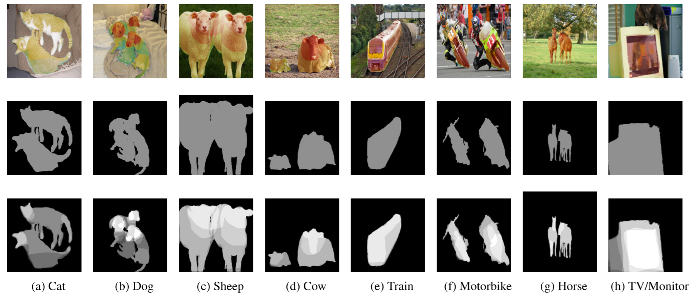
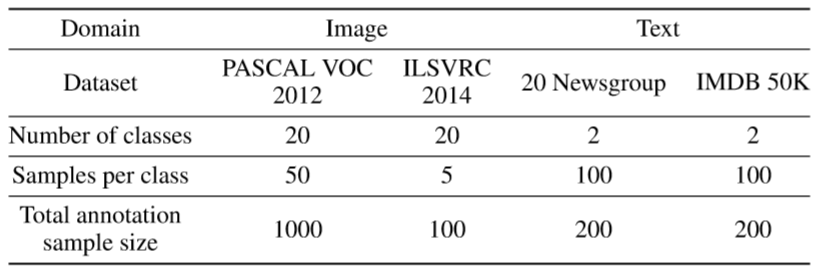

# ML-Interpretability-Evaluation-Benchmark

This repository is a benchmark for quantitative evaluation of model saliency/attention map explanations from any interpretability technique. 
We propose a human-attention baseline for image and text domains using multi-layer human-attention masks aggregated from multiple human annotators.  

## Main Idea
In order for people to be able to trust and take advantage of the results of advanced machine learning solutions for real-world problems, people need to be able to understand the machine rationale for given output.
The proposed human-grounded benchmark enables fast, replicable, and objective execution of evaluation experiments for saliency explanations. 
[In this paper](https://arxiv.org/abs/1801.05075), we demonstrate this benchmark's utility for quantitative evaluation of model explanations and compare it with the binary feature mask ground truth (e.g., object segmentation mask) and human judgment rating evaluations.
Our study results reveal the efficiency of threshold-agnostic (e.g., mean absolute error) evaluation metrics with human-attention baseline as compared to previous methods with binary ground truth masks. 
Our experiments also reveal different user biases in their subjective rating of explanations.


### Human-Attention Mask
We present an evaluation benchmark to evaluation saliency explanations for text and image domains. 
The human-attention baseline in this benchmark is generated from 10 unique user annotations for each image and text samples. 
Here are some image examples to compare single-layer segmentation mask and multi-layer human-attention mask: 



Similarly, words and phrases are weighted based on annotators' selection for each text article. Text explanations are listed in JSON format files.
This table shows number of samples with human-attention baseline from four public available image and text datasets: 



## Benchmark Sctructure
- `Image`
   - `org_img`: Original images which are 100 sample images from 25 different subjects (ImageNet dataset).
   - `human_attention_mask`: Human-attention mask for objects in form of a weighted mask.
   - `human_attention_overlay`: Heatmap visualization of user weighted masks over the original image.
   - `object_segmentation_mask`: Binary target objects' segmentation mask for each image.
   
- `Text`
  - `org_documents`: Original documents which are 100 samples from electronic and medical topics (20 newsgroup dataset).
  - `user_evaluation`: Human grounded explanation for text articles in form of weighted words.
  
  
## Citation

More details and experiment results in this paper: https://arxiv.org/pdf/1801.05075.pdf

```
@article{mohseni2020benchmark,
  title={Quantitative Evaluation of Machine Learning Explanations: A Human-Grounded Benchmark},
  author={Mohseni, Sina and Ragan, Eric D and Block, Jeremy E},
  journal={arXiv preprint arXiv:1801.05075},
  year={2020}
}
```
